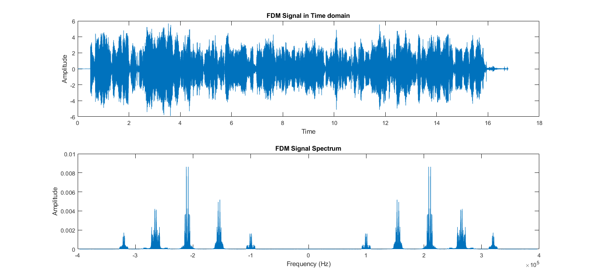
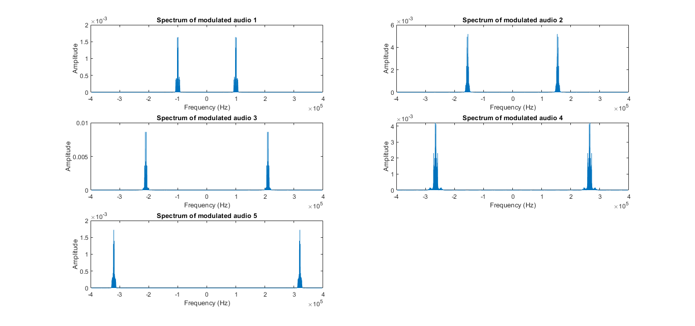
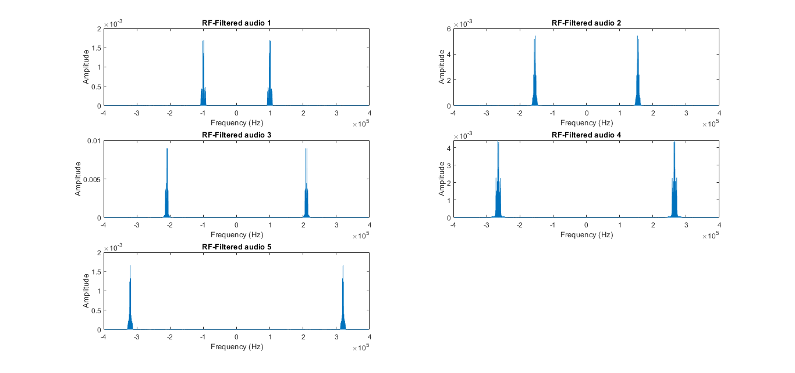
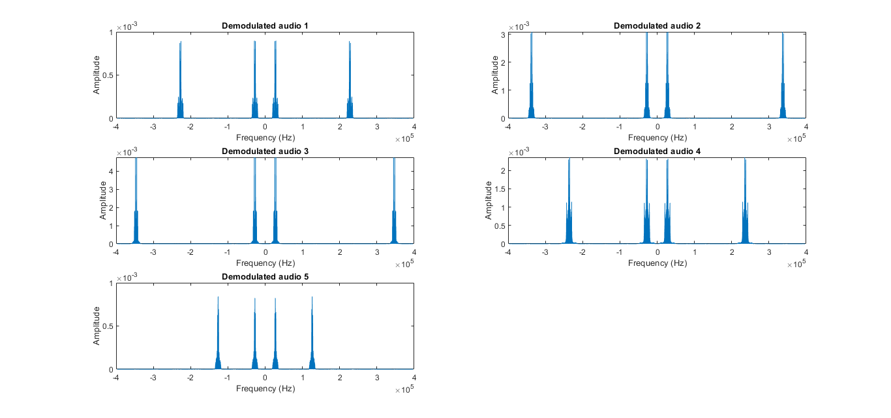
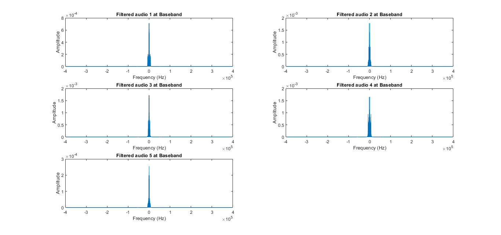
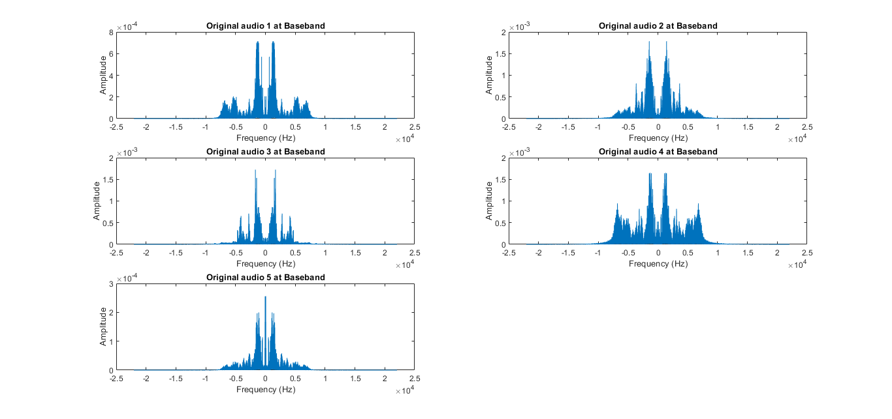

# Super-Hetrodyne-Receiver
 The purpose of this project is to simulate the basic components of an analog communication system using MATLAB. Specifically, an AM modulator and a corresponding super-heterodyne receiver will be simulated using radio-station generated signals.
  
 
| 1                                   | 2                                   | 
| ------------------------------------|------------------------------------ | 
|              |              |
| 3                                   | 4                                   | 
|              |              |
| 5                                   | 6                                   | 
|              |              |

