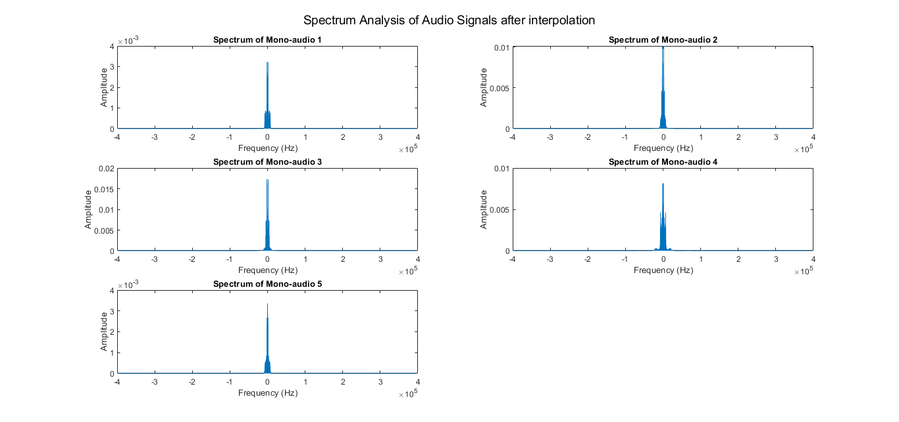

# Super-Hetrodyne-Receiver
 The purpose of this project is to simulate the basic components of an analog communication system using MATLAB. Specifically, an AM modulator and a corresponding super-heterodyne receiver 
 will be simulated using radio-station generated signals, The input message is modulated and wirelessly transmitted. The receiver detects the message using multiple stages of mixing and 
 filtering. 
 Note: in real life the modulated FDM signal is transmitted over the air from the base station. Simulating this wireless channel is out of the scope of this project.

# System Block Diagram
 

# Results
  
| 1                                   | 2                                   | 
| ------------------------------------|------------------------------------ | 
|              |              |
| 3                                   | 4                                   | 
|              |              |
| 5                                   | 6                                   | 
|              |              |

